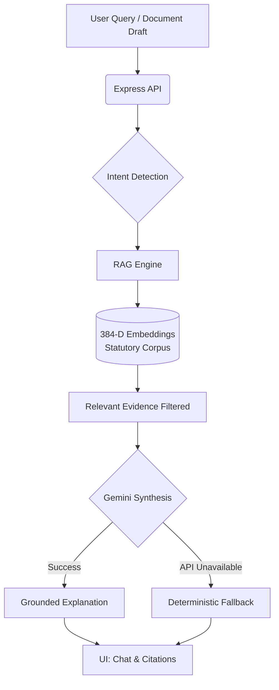

# Kanoon — AI-Powered Indian Legal Documentation Assistant 🇮🇳

## 🏛️ Problem Statement
Understanding Indian law and preparing legally sound documents is often complex, expensive, and intimidating for individuals, freelancers, and small businesses. Legal jargon is dense, official statutory references are difficult to navigate, and relying on general-purpose AI for legal advice is risky due to hallucinations and invented citations.

## 💡 Solution
**Kanoon** is a unified legal documentation assistant built on a verifiable Retrieval-Augmented Generation (RAG) architecture. It demystifies legal queries into plain English and drafts legally grounded contracts using a strict evidence-based pipeline. Kanoon combines:
- **Indexed Statutory Corpus**: Central/Union laws and Karnataka State laws.
- **RAG-based Legal Retrieval**: Powered by 384-D dense embeddings using `Xenova/all-MiniLM-L6-v2`.
- **Intent & Scenario Detection**: Smart filtering to detect rent, property, or contract disputes.
- **Gemini-Powered Synthesis**: Natural language explanations powered by `gemini-3.5-flash-lite`, strictly constrained to the retrieved context.
- **Grounded Responses**: All answers are derived from verified statutory evidence.
- **Verifiable Statutory Citations**: Direct references to sections and Acts.
- **Deterministic Fallback**: Automatically falls back to a deterministic explanation engine if the Gemini API is unavailable or rate-limited.
- **Smart Document Drafting**: Generates context-aware legal documents (e.g., NDAs, Leases) with side-by-side citation display.
- **Official Government Links**: Every citation includes a link to the official `indiacode.nic.in` or state government portal.

## ⭐ Key Features
- **Natural-Language Legal Queries**: Ask questions in plain English and receive clear, non-lawyer explanations.
- **Central + Karnataka Law Coverage**: Handles scenarios involving both federal and specific Karnataka state jurisdictions.
- **Scenario-Aware Retrieval**: Dynamically boosts relevance for specific situations like property sales or Bengaluru rentals.
- **Evidence-Grounded AI Explanations**: The AI is restricted from inventing legal rules, penalties, or deadlines.
- **Section-Level Citations**: Exact Act names, section numbers, and titles are preserved and displayed.
- **Official India Code Source Links**: Cryptographically verified links to official government PDFs.
- **Out-of-Domain Query Handling**: If a query is not covered by the indexed corpus (e.g., sports trivia), Kanoon safely reports insufficient evidence instead of hallucinating.
- **Gemini Synthesis with Fallback**: Uses Google Gemini for fluid text generation, with a robust deterministic fallback to ensure uptime.
- **Legal Document Generation & Download**: Draft custom agreements and download them instantly.
- **Citation Relevance Filtering**: Ensures only materially supportive citations are displayed alongside explanations.

## 📐 Architecture


> **Note:** Gemini is used strictly as a natural-language synthesis layer. All statutory evidence, chunk retrieval, and citation metadata originate independently from the verified RAG pipeline. Gemini does not generate or invent citations.

## 🧰 Tech Stack
- **Frontend**: React, TypeScript, Vite, Tailwind CSS
- **Backend**: Node.js, Express, TypeScript
- **AI / RAG Pipeline**: 
  - `@google/genai` (Gemini 3.5 Flash Lite)
  - `@xenova/transformers` (`Xenova/all-MiniLM-L6-v2`)
  - 384-Dimensional local embeddings

## 📚 Legal Data Sources
The RAG corpus contains highly relevant, processed provisions from Indian statutory material. All retrieved chunks maintain provenance back to official government registries (like India Code). Kanoon does not fabricate Acts or use unverified external APIs for legal knowledge.

## 🛡️ Citation & Grounding Philosophy
1. **Evidence-First**: Retrieved statutory evidence is supplied to Gemini in the prompt.
2. **No AI Citations**: Gemini is explicitly instructed *not* to generate or modify citations.
3. **Application-Managed Citations**: Citations are returned directly from the application's verified local corpus.
4. **Honest Insufficiency**: If sufficient evidence is unavailable in the corpus, Kanoon explicitly states that it lacks the statutory basis to answer, preventing hallucination.

## 🔄 Fallback Architecture
Kanoon is built for high availability. If the Gemini API experiences high demand (e.g., 503 Unavailable) or network failure, the backend seamlessly catches the error and falls back to a deterministic grounded explanation engine. The user still receives the correct citations and a structured, accurate explanation.

## 📁 Project Structure
```text
Kanoon/
├── corpus/
│   ├── raw/                        # Official Government Source PDFs
│   └── processed/
│       └── ingestedCorpus.json     # Vector-Indexed Statutory Chunks
├── server/
│   └── index.ts                    # Express API & Gemini Integration
├── src/
│   ├── components/                 # React UI Components (LegalChatbot, SmartDrafter)
│   ├── services/
│   │   ├── ragEngine.ts            # Core RAG Retrieval & Relevance Filtering
│   │   ├── aiService.ts            # Client-side AI service wrapper
│   │   └── embeddingService.ts     # ONNX 384D Embedding Generator
│   ├── data/
│   │   └── statutoryRegistry.ts    # Official Government Source URLs
├── scripts/                        # Verification & E2E Testing Scripts
├── package.json
└── README.md
```

## 🚀 Setup & Installation

1. **Clone the repository**
   ```bash
   git clone <repository-url>
   cd Kanoon
   ```

2. **Install dependencies**
   ```bash
   npm install
   ```

3. **Configure Environment Variables**
   Create a `.env` file in the root directory:
   ```env
   GEMINI_API_KEY=your_actual_api_key_here
   ```

4. **Run the Backend API Server**
   ```bash
   npm run server
   ```

5. **Start the Frontend Development Server**
   In a new terminal window:
   ```bash
   npm run dev
   ```

## 🧪 Testing
Kanoon includes comprehensive test suites to verify retrieval relevance, E2E logic, and corpus authenticity.
Run the following commands to verify the system:
```bash
# Verify End-to-End scenario logic
npx tsx scripts/testE2EValidation.ts

# Verify relevance scoring and scenario retrieval
npx tsx scripts/testRelevanceAndScenarioRetrieval.ts
```

## 🔐 Security & Responsible AI
- **Server-Side API Keys**: The `GEMINI_API_KEY` is strictly securely managed in the Node.js backend and is never exposed to the client.
- **Constrained Synthesis**: Gemini is forcefully constrained to use *only* the supplied statutory evidence via strict system prompts.
- **Zero Invention**: No legal citations or rules are invented by the LLM.
- **Disclaimer**: Kanoon is a legal documentation assistant and hackathon prototype. Users should always verify important legal matters with qualified legal professionals.

## 📌 Current Status
**Hackathon Prototype / MVP.** Kanoon demonstrates a highly verifiable, production-ready RAG architecture for legal documentation, but is not intended to serve as binding legal advice.
