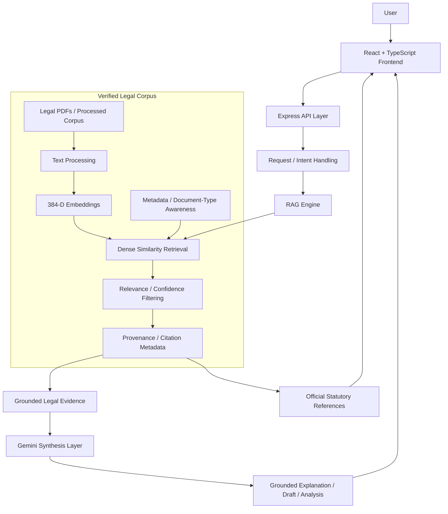

<div align="center">

# Kanoon 🇮🇳
### AI-Powered Indian Legal Documentation Assistant

Kanoon combines AI-assisted legal document drafting, legal document analysis, statutory retrieval, grounded legal explanations, and official legal source references for the Indian legal context.

<p>
  
  
  
  
  
</p>

*A verifiably grounded, accessibility-first approach to Indian legal-tech.*

</div>

<hr/>

## 1. Problem Statement
Understanding Indian law and preparing legally sound documents is often complex, expensive, and intimidating for individuals, freelancers, and small businesses. Legal language is dense, official statutory references are difficult to navigate, and drafting documents manually is time-consuming. Identifying risky or missing clauses requires specialized expertise. Furthermore, relying on general-purpose AI for legal advice is dangerous due to its propensity to hallucinate legal rules or fabricate citations. Finding and verifying the underlying statutory source for an AI-generated claim is traditionally difficult.

## 2. Proposed Solution
Kanoon addresses these challenges through a strict, deterministic Retrieval-Augmented Generation (RAG) architecture. 

The core architectural philosophy is:
**User request → retrieval of relevant statutory evidence → evidence filtering → grounded AI synthesis → explanation / draft / analysis → statutory references**.

Kanoon does not treat the LLM (Google Gemini) as the legal knowledge base. Instead, the local RAG pipeline supplies all necessary legal evidence and provenance. Gemini is utilized primarily as a highly capable natural-language synthesis layer to explain and structure the retrieved evidence in plain English, ensuring responses are rigorously grounded in verifiable statutory text.

## 3. Key Implemented Features

### Legal Intelligence
- **AI-powered legal document drafting**: Context-aware contract generation (e.g., NDAs, Leases).
- **Smart document customization**: Granularly adjust generated legal clauses based on user needs.
- **Document summarization**: Extracts the core essence of uploaded legal texts.
- **Document review / analysis**: Scans uploaded files for critical and high-risk traps or missing provisions.
- **Legal Risk Brief generation**: Creates structured, actionable Legal Risk Briefs for advocate handoff.
- **Clause analysis and customization**: Evaluates individual clauses for safety, unconscionability, and compliance.
- **Legalese simplification**: Translates dense, complex legal text into plain English effortlessly.
- **Unified legal chatbot**: A conversational assistant that answers legal queries grounded strictly in verified statutes.
- **RAG-based statutory retrieval**: Advanced vector search against local legal corpora utilizing 384-D dense embeddings.

### Legal Source Grounding
- **Official statutory references / citations**: Legal claims include direct section-level provenance linking to official government repositories.
- **Legal evidence provenance**: Citations are structurally tied to the retrieved evidence, completely independent of the LLM generation step.
- **Act / section / jurisdiction metadata**: Identifies the exact Act name, section number, and jurisdiction (e.g., Central or Karnataka) for retrieved provisions.
- **Links to official government sources**: Verifiable URLs to official registries like indiacode.nic.in are provided for retrieved citations.
- **Central / Union and Karnataka legal corpus**: Comprehensive handling of both federal and specific state-level jurisdictions.

### User Experience
- **Expert / advocate hub**: An integrated directory allowing users to consult and hand-off briefs to curated legal experts.
- **Document/PDF viewing**: Built-in document viewer with clean typography for reading legal drafts.
- **Document export**: Export finalized drafts directly to PDF format or print directly from the browser.
- **Light theme**: A polished, highly readable light mode optimized for long-form legal text.
- **Dark theme**: A fully semantic dark mode designed to reduce eye strain during extended reading.
- **Accessibility controls**: A dedicated accessibility menu to toggle text size, contrast, and motion reduction.
- **Native browser Read Aloud**: Embedded text-to-speech functionality leveraging the native `window.speechSynthesis` API (no external TTS required). Available within Legal Chatbot responses, Generated legal documents, Document review summaries, and Legal Risk Briefs.

## 4. Why Kanoon is Different

| Traditional Approach | Kanoon |
|---|---|
| Manually search statutes | Retrieval-assisted statutory search |
| Read dense legal language | Plain-language explanations |
| Draft documents manually | AI-assisted contextual drafting |
| Manually inspect clauses | Clause/risk analysis |
| Difficult to trace AI answers to sources | Statutory provenance and official references |
| Limited accessibility | Text size, contrast, keyboard and Read Aloud support |

## 5. System Architecture
The Kanoon architecture ensures that retrieval strictly precedes generation, isolating legal facts from the generative process.



## 6. Technology Stack
- **Frontend**: React 19, TypeScript, Vite, Tailwind CSS, Lucide React
- **Backend**: Node.js, Express, TypeScript (run via `tsx`)
- **AI Synthesis**: `@google/genai` (Gemini 3.5 Flash Lite)
- **Local AI Embeddings**: `@xenova/transformers` (`Xenova/all-MiniLM-L6-v2`) via ONNX Web Runtime
- **Document Processing**: `jspdf`, `html2canvas`, `pdf-parse`

## 7. Project Structure
```text
Kanoon/
├── corpus/
│   ├── raw/                        # Official Government Source PDFs
│   └── processed/
│       └── ingestedCorpus.json     # Vector-Indexed Statutory Chunks
├── server/
│   └── index.ts                    # Express API & Gemini Integration
├── src/
│   ├── components/                 # React UI Components (SmartDrafter, Chatbot, etc)
│   ├── services/
│   │   ├── ragEngine.ts            # Core RAG Retrieval & Relevance Filtering
│   │   ├── aiService.ts            # Client-side AI service wrapper
│   │   └── embeddingService.ts     # ONNX Embedding Generator
│   ├── data/
│   │   └── expertAdvocates.ts      # Advocate Directory Data
├── package.json
└── README.md
```

## 8. API Overview
- **`POST /api/chat`**: Handles semantic retrieval and Gemini-powered conversational responses.
- **`POST /api/draft`**: Generates full contracts based on intent and RAG chunks.
- **`POST /api/simplify`**: Converts dense legalese to plain English summaries.
- **`POST /api/review`**: Evaluates uploaded documents for missing clauses, traps, and risks.
- **`POST /api/analyze-clause`**: Analyzes specific clauses for validity and unconscionability.

## 9. Setup & Environment Variables
1. **Clone the repository:**
   ```bash
   git clone <repository-url>
   cd Kanoon
   ```
2. **Install dependencies:**
   ```bash
   npm install
   ```
3. **Environment Variables:**
   Create a `.env` file in the root directory:
   ```env
   GEMINI_API_KEY=your_actual_api_key_here
   ```
4. **Run the Backend API Server:**
   ```bash
   npm run server
   ```
5. **Start the Frontend Development Server:**
   ```bash
   npm run dev
   ```

## 10. Security & Reliability
- **Server-Side AI Execution**: The `GEMINI_API_KEY` is securely managed strictly on the backend and never exposed to the client bundle.
- **Deterministic RAG Isolation**: The LLM is structurally prevented from modifying, generating, or hallucinating citations.
- **Reliable Fallback**: The architecture features a deterministic fallback path should the Gemini API become unavailable.

## 11. Current Limitations / Future Scope
The current iteration is a functional hackathon prototype. The following features are **NOT** currently implemented and remain in the future scope:
- **Multilingual Legal Drafting**: Generating non-English legal contracts.
- **Multilingual UI & Voice**: Translating the web interface and TTS voices into regional languages.
- **Production-Scale Deployment**: Migration from local JSON vector stores to a dedicated database (e.g., Pinecone/Milvus).
- **Persistent User Accounts**: User authentication, saved document history, and MongoDB integration are not currently implemented.

## 12. Disclaimer
**Hackathon Prototype / MVP.** Kanoon demonstrates a highly verifiable RAG architecture for legal documentation, but is not intended to serve as binding legal advice. Users should always verify important legal matters with qualified legal professionals.

## 13. License
*(Appropriate Open Source License applies. Kanoon is built for educational and hackathon demonstration purposes.)*
